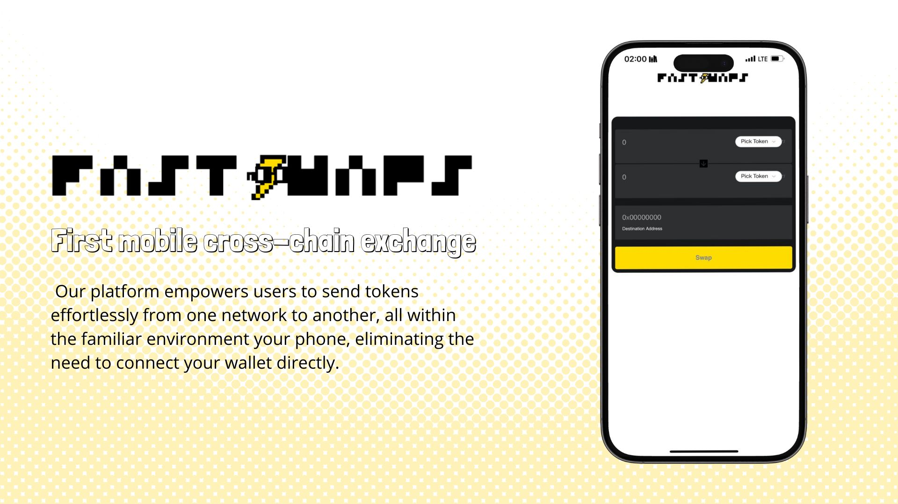
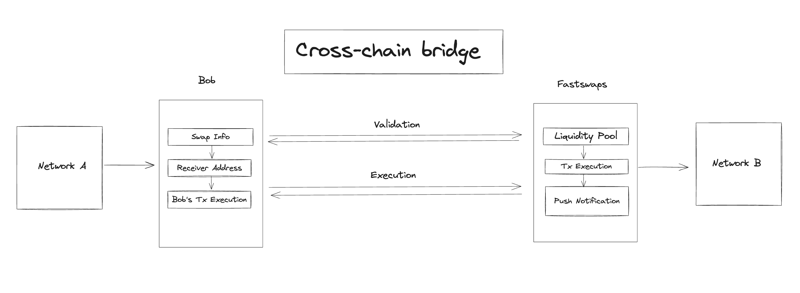

<a name="readme-top"></a>

<div align="center">

[![Contributors][contributors-shield]][contributors-url]
[![Forks][forks-shield]][forks-url]
[![Stargazers][stars-shield]][stars-url]
[![Issues][issues-shield]][issues-url]
<!-- [![MIT License][license-shield]][license-url] -->

</div>

<!-- PROJECT INTRO -->

<br />
<div align="center">
  <a href="https://github.com/sheva323/IstanbulHackathon">
    
  </a>

 <h3 align="center">The best way to get into crypto. Let's swap ⚡️</h3>

  <p align="center">

  [Eth Global Istanbul 2023 Hackaton Project](https://ethglobal.com/events/istanbul)

  <a href="#-about-the-project">View the Demo</a>&nbsp;&nbsp;&nbsp;|&nbsp;&nbsp;&nbsp;
  <a href="#-technologies">Report a Bug</a>&nbsp;&nbsp;&nbsp;|&nbsp;&nbsp;&nbsp;
  <a href="#-getting-started">Request a Feature</a>&nbsp;&nbsp;&nbsp;
   <!--
    <a href="https://github.com/sheva323/IstanbulHackathon">View Demo</a>
    -->
  </p>

</div>

<br />


<!-- TABLE OF CONTENTS -->

# Table of Contents 

1. [About de Project](#about-the-project)
    - [Built With](#built-with)
2. [Getting Started](#getting-started)
    - [Prerequisites](#prerequisites)
    - [Installation](#installation)
3. [Usage](#usage)
4. [Roadmap](#roadmap)
5. [Contributing](#contributing)
6. [Licence](#license)
7. [Contact](#contact)
8. [Acknowledgments](#acknowledgments)

<br />


<!-- ABOUT THE PROJECT -->

# About The Project

<!--  br />

[![Product Name Screen Shot][product-screenshot]](https://example.com)
<br /> -->

First mobile cross-chain exchange. Our platform empowers users to send tokens effortlessly from one network to another, all within the familiar environment your phone, eliminating the need to connect your wallet directly.

By eliminating the need for direct wallet connections, FastSwaps not only enhances user convenience but also prioritizes security, providing a seamless and secure gateway for individuals to navigate the crypto world with ease.

The entire process is outlined in the following diagram: 



## Process Explanation:

1. **User Initiation:**
Users select the destination for their funds without the need for a connected wallet.

2. **Endpoint Validation:**
A validation endpoint ensures sufficient liquidity on one side before providing the user with the destination address. Simultaneously, it generates wallet and swap information for user execution.

3. **User Transaction:**
Users send funds to the provided wallet address. A centralized watcher (for the hackathon MVP) monitors the transaction.

4. **Watcher Functionality:**
The watcher validates the incoming transaction and extracts liquidity from the other network. Using the Cow Protocol, it executes swaps, facilitating the finalization of the transaction and enabling the user to receive the funds.


<p align="right">(<a href="#readme-top">back to top</a>)</p>

<!-- USAGE EXAMPLES -->

Acá va el demo en video y un par de bundles


<p align="right">(<a href="#readme-top">back to top</a>)</p>


# Built With


FastSwaps is proudly supported by the following sponsors:

**Frontend Deployment:**

Deployed using Near BOS, our frontend interfaces with three endpoints critical for watcher functionality and validating liquidity pools to execute transactions securely.

[![Polybase][Polybase.xyz]][Polybase-url]

<!-- Comment de Uso de NEAR BOS -->

**Protocol and Networks:**
Cow Protocol hooks are utilized for swaps, showcasing the proof of concept on Gorli and Polygon networks during the hackathon.

[![Push][Push.org]][Push-url]


<!-- Comment de Uso de Cow Swap e info de repo -->

**User Experience and Design:**

The project prioritizes an enhanced user experience and design through Nouns style and vibes.

[![NFT.STORAGE][NFT.Storage]][NFT-url]


<!-- Comment de presentación y rcueros usadodsS -->

By implementing this decentralized cross-chain exchange, we aim to revolutionize the way users transfer funds across networks, ensuring security, efficiency, and a user-friendly experience.


In the development of the FastSwaps, we used the following technologies:


* [![Next][Next.js]][Next-url] | React
* [![Chakra][chakra-ui]][chakra-url] | BOS Near
* [![Node][Node.js]][Node-url]

Node.js 
Mongo BD
CELO


These powerful tools and frameworks have helped us create a seamless user experience and ensure the scalability and reliability of our platform.

<p align="right">(<a href="#readme-top">back to top</a>)</p>


<!-- GETTING STARTED   -->

# Getting Started

To get started with FastSwaps, follow these steps:

1. Explore the possible swaps and select your prefered one.

2. Once your agree with the swap, write down the wallet where you're want to rececive and you're going to receive the funds.

3. A few minutes later, you're going to receive a Push Notification it's done, check your wallet.

That's it!. The best way to get into crypto.


## Installation 

To get started with Join installation, follow these steps:

1. Clone the repo
   ```sh
   git clone https://github.com/sheva323/IstanbulHackaton
   ```
2. Navigate to the project directory:
   ```sh
   cd IstanbulHackaton
   ```
3. Install the necessary dependencies:
   ```js
   npm install
   ```
4.  Configure the environment variables:
  * Rename the .env.example file to .env.
  * Open the .env file and fill in the required configuration values.
5. Start the development server:
    ```js
   npm run dev
   ```
6. Open your web browser and visit http://localhost:3000 to access the Join application.

Please note that the above steps assume you have Node.js and npm (Node Package Manager) installed on your machine.

Enjoy using FastSwaps and stay connected with the exciting world of tech and web3 events!


<p align="right">(<a href="#readme-top">back to top</a>)</p>

<!-- CONTRIBUTING -->

## Contributing

At FastSwaps, we believe that contributions from the open-source community are what make our project truly amazing. We appreciate any contributions you make and welcome your ideas, suggestions, and enhancements.

If you have a suggestion or improvement that would help make Join even better, here's how you can contribute:

1. Fork the project
2. Create a new branch for your feature or enhancement
   ```sh
    $ git checkout -b feature/IstanbulHackaton
   ```
3. Make the commit with your changes
   ```sh
    $ git commit -m 'Add some IstanbulHackaton
   ```
4. Send the code to your remote branch
   ```sh
    $ git push origin feature/IstanbulHackaton
   ```
5. Open a Pull Request to submit your changes

We also encourage you to open an issue with the "enhancement" tag if you have any ideas or suggestions that you'd like to discuss with the community.

Thank you for being part of the FastSwaps community and for helping us make a difference!


<!-- ROADMAP -->
# Roadmap

Today through FastSwaps we to send tokens effortlessly from one network to another, without the need to connect your wallet direct and without no KYC.

As working Plan

- [] Telegram integration
- [] More rollups aggregators and token support
- [] More rollups aggregators and token support
- [] Push notification and chat integration to connect with team
- [ ] Off-chain ramps

See the [open issues](https://github.com/sheva323/IstanbulHackaton/issues) for a full list of proposed features (and known issues).

And with the vision to  make crypto more accessible and inclusive, simplifying the complexities associated with cross-chain transactions.

<p align="right">(<a href="#readme-top">back to top</a>)</p>


<!-- CONTACT -->

### FastSwaps Team

Angela Ocando - [@ocandocrypto](https://twitter.com/ocandocrypto) - ocandocrypto@proton.me - PM 
<br />
Sebastian Guaqueta - [@scguaquetam](https://twitter.com/scguaquetam) - sheva3232@gmail.com - Frontend
<br />
Jonathan Diaz - [@jontdiaz](https://twitter.com/jonthdiaz) - JonthDiaz@gmail.com - Backend 
<br />
Felipe Marin - [@felipemarinWeb3](https://twitter.com/felipemarinWeb3) - luisf.maring0910@gmail.com - Smart Contract Developer
<br />

<p align="right">(<a href="#readme-top">back to top</a>)</p>


<!-- ACKNOWLEDGMENTS -->

# Acknowledgments

We would like to express our gratitude to the following resources that have been invaluable in the development of FastSwaps:

BOS Docs
CELO Docs
Base Docs
Nouns Designer Dos
1inch Docs
Cow Swaps Docs
Gnosis Chain Docs 

* [Push Protocol Docs](https://docs.push.org/hub/)
* [Polybase Docs](https://polybase.xyz/docs/introduction)
* [Spheron Docs](https://docs.spheron.network/)
* [ENS Docs](https://docs.ens.domains/)
* [NFT.Storage Docs](https://nft.storage/docs/)
* [Filecoin Docs](https://docs.filecoin.io/)

These resources have provided valuable insights, tools, and inspiration throughout the development process. We appreciate their contributions to the web development community.

<p align="right">(<a href="#readme-top">back to top</a>)</p>


<!-- MARKDOWN LINKS  -->

[contributors-shield]: https://img.shields.io/github/contributors/sheva323/IstanbulHackathon.svg?style=for-the-badge&color=yellow
[contributors-url]: https://github.com/sheva323/IstanbulHackathon/graphs/contributors
[forks-shield]: https://img.shields.io/github/forks/sheva323/IstanbulHackathon.svg?style=for-the-badge&color=blue
[forks-url]: https://github.com/sheva323/IstanbulHackathon/network/members
[stars-shield]: https://img.shields.io/github/stars/sheva323/IstanbulHackathon.svg?style=for-the-badge&color=yellow
[stars-url]: https://github.com/sheva323/IstanbulHackathon/stargazers
[issues-shield]: https://img.shields.io/github/issues/sheva323/IstanbulHackathon.svg?style=for-the-badge&color=blue
[issues-url]: https://github.com/sheva323/IstanbulHackathon/issues

<!-- 
[license-shield]: https://img.shields.io/github/license/sheva323/JOIN.svg?style=for-the-badge
[license-url]: https://github.com/sheva323/JOIN/blob/main/LICENSE.txt -->

<!-- IMAGES -->

[product-screenshot]: images/product.png

<!-- SPONSORS -->

[Polybase.xyz]:https://img.shields.io/badge/Polybase-FFFFFF?style=for-the-badge&logo=polybase&logoColor=black
[Polybase-url]:https://polybase.xyz
[Push.org]:https://img.shields.io/badge/push-e03dc1?style=for-the-badge&logo=push&logoColor=white
[Push-url]:https://push.org
[NFT.Storage]:https://img.shields.io/badge/nft.storage-EE4116?style=for-the-badge&logo=nftdotstorage&logoColor=white
[NFT-url]:https://nft.storage
[Spheron.network]:https://img.shields.io/badge/spheron-0000ff?style=for-the-badge&logo=spheron&logoColor=blue
[Spheron-url]:https://spheron.network/
[Ens.domains]:https://img.shields.io/badge/ens-4f81fe?style=for-the-badge&logo=ens&logoColor=blue
[Ens-url]:https://ens.domains/
[Filecoin.io]:https://img.shields.io/badge/filecoin-40bec8?style=for-the-badge&logo=filecoin&logoColor=blue
[Filecoin-url]:https://filecoin.io/

<!-- TOOLS AND FRAMEWORKS  -->


[Next.js]: https://img.shields.io/badge/next.js-000000?style=for-the-badge&logo=nextdotjs&logoColor=white
[Next-url]: https://nextjs.org/
[chakra-ui]:https://img.shields.io/badge/chakra-2ABFB3?style=for-the-badge&logo=chakraui&logoColor=white
[chakra-url]:https://chakra-ui.com
[Node.js]:https://img.shields.io/badge/node.js-333333?style=for-the-badge&logo=nodedotjs&logoColor=689F63
[Node-url]:https://nodejs.org/en

<!-- We're back, booom> -->
